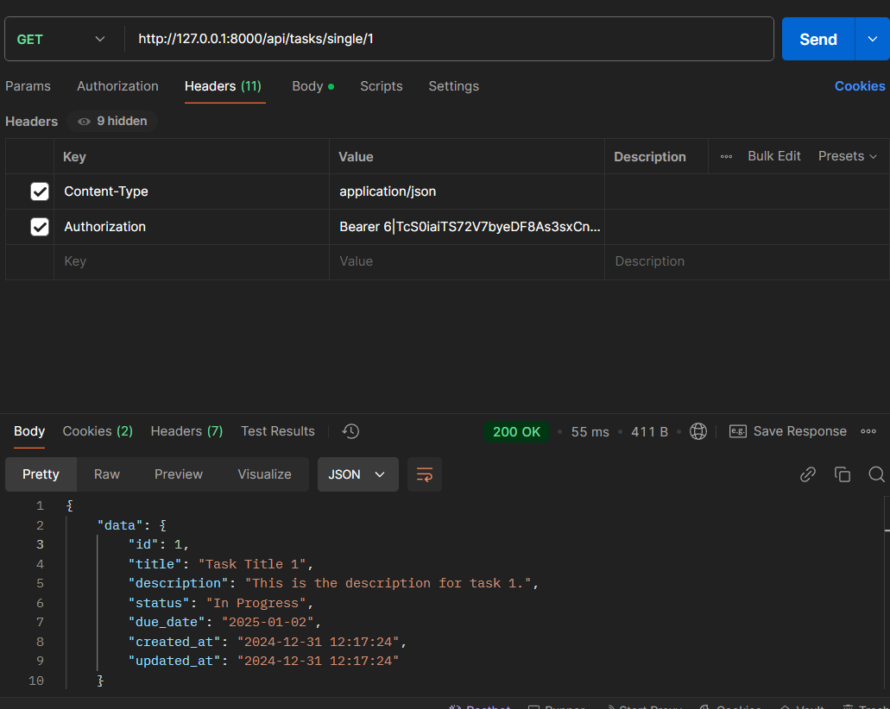
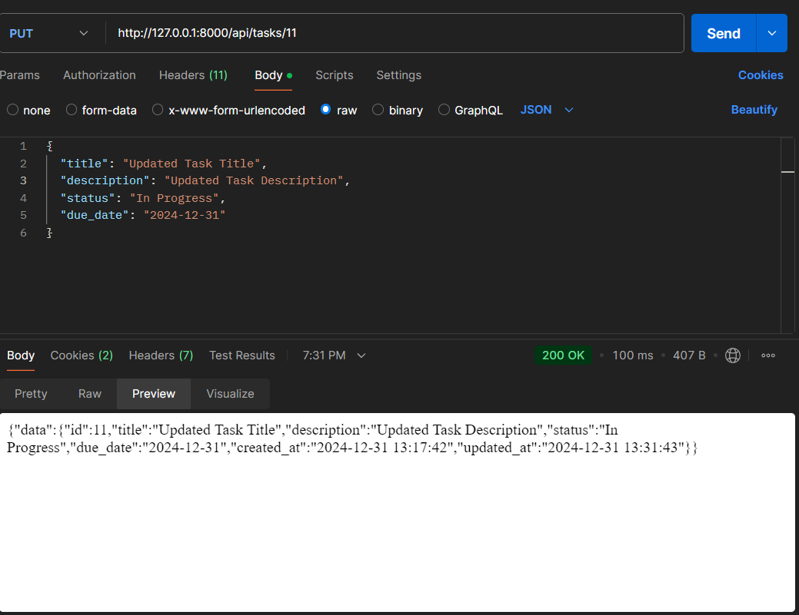

The project can be tested by browser at http://127.0.0.1:8000,
**OR**
Project can be tested by **Postman** at http://127.0.0.1:8000/api

## Dependencies
- PHP = 8.4
- Composer
- Node.js >= 22.x
- MySQL

***API Endpoints*** are given after installation.

## Installation

Follow these steps to set up the project on your local machine:

### 1. Clone the Repository
git clone https://github.com/tawshiqulislam/task-management-system.git
cd task-management-system

### 2. Install Backend Dependencies
composer install

### 3. Install Frontend Dependencies and serve
npm install
npm run dev

### 4. Set Up the Environment
Copy the .env.example file and rename it to .env.
Update database and other configuration details in the .env file.
Create a database in phpMyAdmin using same name as .env file.

### 5. Generate the Application Key
php artisan key:generate

### 6. Run Migrations and seed
php artisan migrate --seed

8. Serve the Application
php artisan serve

Open the application in your browser at http://127.0.0.1:8000.

### **Complete Registration/Login for access_token and use the access_token for further requests with Task.**
Testing endpoints using **Postman**:
    1. In Header tab write a new header. Key: Content-Type ; Value: application/json ; (preferred)
    2. After getting aceess_token copy it. In Header tab write a new header. 
        - Key: Authorization ; Value: Bearer <access_token>
    3. In Body tab write a new request body. Key: raw ; Value: JSON
    4. Send the request to the desired endpoint.

### *API ENDPOINTS:* Login
URL: /api/login
Method: POST
**Request Body (JSON):**
{
    "email": "test@example.com",
    "password": "test@example.com"
}
### Example Screenshot:

### *API ENDPOINTS:* Registration
URL: /api/login
Method: POST
**Request Body (JSON):**
{
    "name": "Test User",
    "email": "testuser@xyz.com",
    "password": "password",
    "password_confirmation": "password"
}
### Example Screenshot:

### *API ENDPOINTS:* Get All Tasks
URL: /api/tasks
Method: GET
Query Parameters (optional): status: Filter tasks by Pending, In Progress, or Completed. sort: Sort tasks by due_date in asc or desc order.
URL Example: /api/tasks  **OR**   /api/tasks?status=Pending&sort=asc
### Example Screenshot:

### *API ENDPOINTS:* Create a New Task
URL: /api/tasks/single/{id}
Method: GET
Description: Seaerch a task by ID
Screenshot:

### *API ENDPOINTS:* Create a New Task
URL: /api/tasks
Method: POST
Description: Creates a new task.
Authorization: Requires user authentication.
**Request Body (JSON):**
{
  "title": "Task Title",
  "description": "Task Description",
  "status": "Pending",
  "due_date": "2024-12-31"
}
### Example Screenshot:

### *API ENDPOINTS:* Update an Existing Task
URL: /api/tasks/{id}
Method: PUT or PATCH
Description: Updates an existing task.
Authorization: Only accessible if the task belongs to the authenticated user.
**Request Body (JSON):**
{
  "title": "Updated Task Title",
  "description": "Updated Task Description",
  "status": "In Progress",
  "due_date": "2024-12-31"
}
### Example Screenshot:

### *API ENDPOINTS:* Delete a Task
URL: /api/tasks/{id}
Method: DELETE
Description: Deletes a task by its ID.
Response: Returns a success message in JSON format.
Authorization: Only accessible if the task belongs to the authenticated user.
### Example Screenshot:

